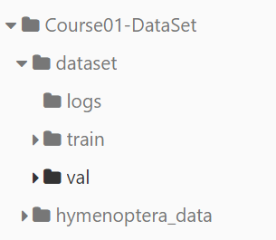
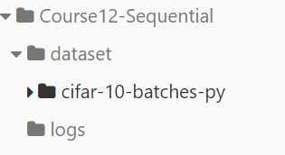
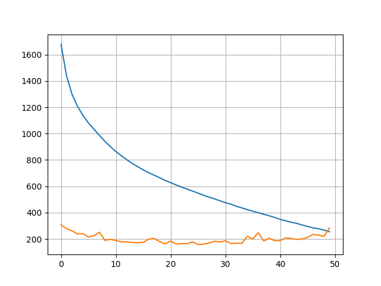

# PyTorch 学习项目

## 简介
本项目旨在通过实践学习 PyTorch 框架，涵盖了从基础到高级概念的学习与应用。通过一系列教程和练习，你将能够掌握如何构建、训练和优化深度学习模型。很多的Course需要用到dataset，参考[Release 数据集 · yzmninglang/Pytorch_Learning](https://github.com/yzmninglang/Pytorch_Learning/releases/tag/1.0)。组织架构如图,对于课程一的组织架构如图，对于其他用到CIFAR10的如右图所示

|||

## 目录结构

以下是本项目的主要目录结构及其用途说明，帮助你快速了解和导航到所需的文件，其中涉及到的文档部分请参考 [Doc](Doc) 目录


###  [Course08-Conv2d](Course08-Conv2d) 

目录结构：[Course08-Conv2d](./Course08-Conv2d)，此次实验中主要涉及到reshape的用法，其具体内容需要参考[torch.reshape — PyTorch 2.6 documentation](https://pytorch.org/docs/stable/generated/torch.reshape.html)以及add_images的用法


由于Course08中设置的out_channels大于3，对于SummaryWriter无法显示，因此需要用到reshape修改tensor的大小，此外，对于SummaryWriter的来说，由于add_image针对的**一个图片**，接受CHW图片，但是对于batch来说，格式为**NCHW**，所以需要使用**add_images**


###  [Course09-Pool](Course09-Pool) 

[Course09-Pool](./Course09-Pool),对于池化来说，一定要注意nn.MaxPool2d只接受tensor元素类型为float的类型，因此需要提前将其转化为float32，方法是在tensor(...,dtype=torch.float32),除此之外，注意ceilmode的设置


###  [Course10-Activate](Course10-Activate) 

 [Course10-Activate](Course10-Activate) 主要是介绍了激活函数的用法，本身没有十分特别的，注意常规操作即可


###  [Course11-Linear](Course11-Linear) 

这一节主要是涉及到线性层的特点，线性层主要要注意nn.Linear需要添加两个参数，输入的维度和输出维度，除此之外，需要注意Flatten的展开方式，可以参考

- [torch.flatten — PyTorch 2.6 documentation](https://pytorch.org/docs/stable/generated/torch.flatten.html)
- [Pytorch 中 torch.flatten() 和 torch.nn.Flatten() 实例详解 - 别关注我了，私信我吧 - 博客园](https://www.cnblogs.com/BlairGrowing/p/16074632.html)


###  [Course12-Sequential](Course12-Sequential)

完成了Sequential的部分，一个要注意的还是Flatten的默认参数start_dim为1,所以对应batch_size的那部分的数字不会参与展平[Flatten — PyTorch 2.6 documentation](https://pytorch.org/docs/stable/generated/torch.nn.Flatten.html)。除此之外，学会了Sequential的使用，可以直接把网络操作丢到Sequential函数中去，**不需要将网络组成数组**，然后直接在forward中调用即可[Sequential — PyTorch 2.6 documentation](https://pytorch.org/docs/stable/generated/torch.nn.Sequential.html)。


###  [Course13-LossFunc](Course13-LossFunc)

常见的LossFunc：[Pytorch的损失函数Loss function接口介绍 - 知乎](https://zhuanlan.zhihu.com/p/267787260)。主要介绍L1，L2，和Cross-entropy


###  [Course14-Loss-Network](Course14-Loss-Network)

使用 [Course12-Sequential](Course12-Sequential) 定义的分类网络来使用LossFunc，涉及到了梯度和反向传播，**反向传播的对象是LossFunction，不是Module**


###  [Course15-Optim](Course15-Optim) 

增加了优化器部分，这部分相对来说较为简单，参考官方文档[torch.optim — PyTorch 2.6 documentation](https://pytorch.org/docs/stable/optim.html)。主要需要传入两个参数，即model.parameter()和lr(learning rate)。，设置合适的合适的值，需要注意的是，在每次使用优化器更新参数（优化器来更新）、反向传播（得到梯度）之前，一定执行

```python
optm.zero_grad()
```

同时，可以通过使用epoch（完整跑一轮数据）的参数，来设置轮数，因为整个模型的收敛需要较长的时间，所以需要设置跑多轮的方式


### [Course16-ModifyNN](Course16-ModifyNN)

基于VGG16的修改网络，参考文档[vgg16 — Torchvision 0.21 documentation](https://pytorch.org/vision/stable/models/generated/torchvision.models.vgg16.html#torchvision.models.vgg16)。添加一层add_module，修改某一层vgg16_false.classifier[6] =  nn.Linear(4096,100)


###   [Course17-ModelSave](Course17-ModelSave) 

两种保存模型的方式，一种是同时保存模型参数和网络结构，另一种是只保留网络参数（字典的形式）。，需要考量到`state_dict`函数对载入和保存


###  [Course18-ModelTrainProcess](Course18-ModelTrainProcess) 

主要介绍了一个模型训练的整体步骤，主要涉及模型测试集的测试**（需要关注设置no_grad），不反向传播**。除此之外，使用plt和tensorboard来画图，其中为了在终端有更好的显示，需要借助tqdm库，需参考[【PyTorch总结】tqdm的使用-CSDN博客](https://blog.csdn.net/wxd1233/article/details/118371404)。一般来说，为了让模型在中途可以更好的修改，需要注意一般需要在每个epoch的最后面保存模型，下图为epoch_num为50的Train_loss和Test_Loss（累计误差）的变化曲线,注意观察`model1.train()`和`model1.eval()`对模型的影响[Module — PyTorch 2.6 documentation](https://pytorch.org/docs/stable/generated/torch.nn.Module.html#torch.nn.Module)。



# 模型训练的过程总结：Train [Course19-TrainGPU](Course19-TrainGPU) 

1. 载入dataset，同时将其转化为Tensor数据类型

2. 判断电脑是否有GPU

   ```python
   device = torch.device('cuda' if torch.cuda.is_available() else 'cpu')
   ```

3. 使用DataLoader设置batch_size得到train_data、test_data(在后期部署的时候也要用reshape将其转化为batch_size=1的tensor)

4. 定义一个模型

   ```python
   class model(nn.Module):
       def __init__(self):
           ....定义模型层数（Sequential）
       def forward(self,x):
           ....定义前向传播，return
   ```

5. 实例化一个模型`model1 =model`

   1. 载入模型: `torch.load('...pth')`
   2. 转移到GPU上`model1.to(device)`

6. 定义损失函数对象（转移到GPU上）

7. 定义优化器：

   1. 传入模型参数
   2. 设置学习率

8. 设置epoch_num,进入epoch循环

   1. 定义tqdm对象，传入dataloader对象和长度`loop = tqdm((train_data), total=len(train_data))`

   2. 定义accuary_train和accuary_test

   3. **model进入train模式**（model1.train()）

   4. 进入loop循环：

      1. 获取train_data的img（tensor）和label（tensor）（转移到GPU上）

      2. 计算损失值loss = cross_loss(output,label)

      3. 将**优化器的梯度清0**，loss函数反向传播

      4. 使用优化器更新参数：optm.step()

      5. 计算该轮的准确率，loss值，设置tqdm显示

         ```python
         loop.set_description(f'Epoch [{epoch}/{epoch_num}]')
         temp_train_loss = temp_train_loss+loss.item()
         accuary_temp_train = (output.argmax(1) == label).sum() / len(label)
         accuary_train.append(accuary_temp_train)
         loop.set_postfix(loss=loss.item(),acc= torch.tensor(accuary_train).mean().item())
         
         ```

   5. 计算该epoch的平均准确率，总计Loss，添加到Tensorboard

   6. **model进入eval模式**(model1.eval())

   7. 设置tensor不带grad（梯度）：

      1. 如loop循环一样，提取test_data,转移GPU，经过model，计算Loss，统计Accuary

   8. 保存第`epoch`的模型，保存数据（如Loss、Accuary）


# 模型测试的过程总结：Test [Course20-ModelTest](Course20-ModelTest) 

1. 载入图片PIL,使用tensorforms.Compose将图片先resize（到和训练图片一致），在ToTensor，并利用reshape转为batch_size为1的图batch

2. 新建实例化模型：`model1 = model`

3. 载入模型数据必要时从gpu转为cpu

   ```python
   model_state = torch.load('model/model1_epoch_49.pth',map_location=torch.device('cpu'))
   ```

4. **模型进入eval模式**：model.eval()

5. 设置Tensor为不计算梯度

   1. 图像进入model，输出output
   2. 输出output.argmax(1)为类别的idx，利用类别数组索引即可完成对图像的分类
